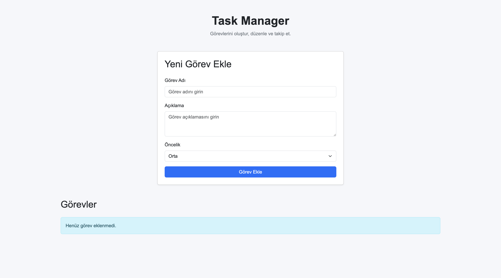
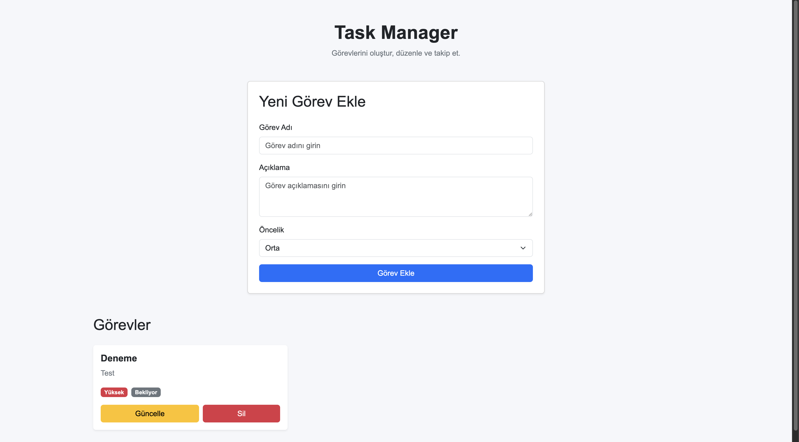
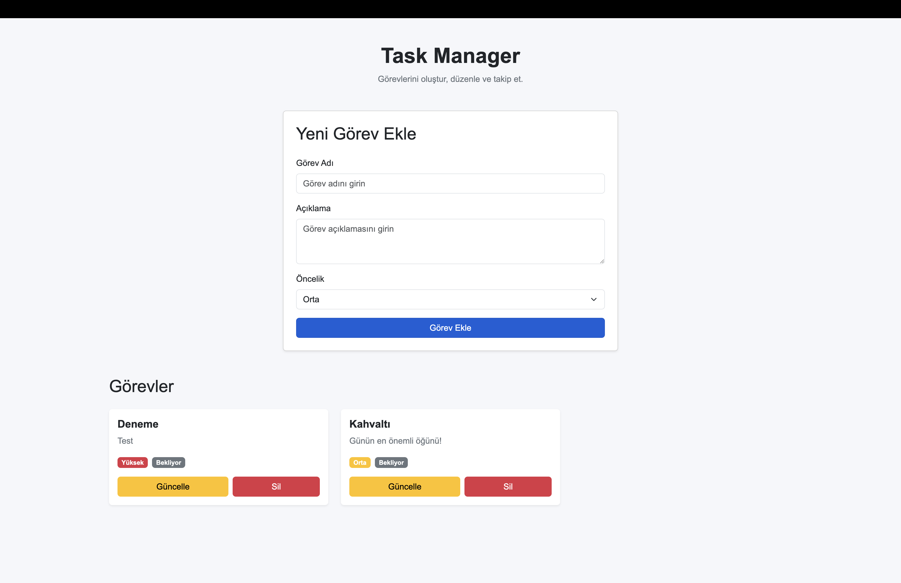

# Task Manager

React ve Bootstrap 5 kullanılarak geliştirilmiş basit bir görev yönetim uygulamasıdır.

Bu proje, modern JavaScript kütüphaneleri kullanılarak CRUD işlemlerinin gerçekleştirilmesini göstermek amacıyla geliştirilmiştir.

## 🚀 Kullanılan Teknolojiler

- React
- JavaScript
- Vite
- Bootstrap 5
- HTML5
- CSS3
- LocalStorage

## 📌 Proje Özellikleri

Uygulama üzerinden görevler oluşturulabilir ve yönetilebilir.

### ➕ Görev Ekleme

Yeni bir görev oluşturulabilir.

Görev için:

- Görev adı
- Açıklama
- Öncelik

bilgileri girilebilir.

### 📋 Görev Listeleme

Eklenen görevler ana sayfada kartlar halinde listelenir.

Her görevde:

- Görev adı
- Açıklama
- Öncelik
- Durum

bilgileri gösterilir.

### ✏️ Görev Güncelleme

Mevcut görevlerin bilgileri güncellenebilir.

Güncelleme butonuna basıldığında görev bilgileri forma aktarılır ve kullanıcı bilgileri değiştirebilir.

### 🗑️ Görev Silme

İstenilen görev uygulamadan silinebilir.

### 💾 LocalStorage

Görevler tarayıcının LocalStorage alanında saklanır.

Bu sayede sayfa yenilendiğinde görevler kaybolmaz.

## 📁 Proje Yapısı

```text
task-manager/
│
├── public/
│
├── src/
│   ├── components/
│   │   ├── TaskCard.jsx
│   │   ├── TaskForm.jsx
│   │   └── TaskList.jsx
│   │
│   ├── interfaces/
│   │   └── Task.js
│   │
│   ├── pages/
│   │   └── Home.jsx
│   │
│   ├── App.jsx
│   ├── App.css
│   ├── index.css
│   └── main.jsx
│
├── index.html
├── package.json
├── package-lock.json
└── vite.config.js
## 

🔧 Kurulum

Projeyi bilgisayarınızda çalıştırmak için öncelikle repository'yi klonlayın:

git clone REPOSITORY_URL

Proje klasörüne girin:

cd task-manager

Gerekli paketleri yükleyin:

npm install

Geliştirme sunucusunu başlatın:

npm run dev

Daha sonra terminalde gösterilen localhost adresini tarayıcıda açabilirsiniz.

🏗️ Production Build

Production versiyonunu oluşturmak için:

npm run build

komutu kullanılabilir.

Build sonucunda Vite tarafından dist klasörü oluşturulur.

🌐 Canlı Demo

Proje Netlify üzerinden yayınlanmıştır.

Canlı Demo:
BURAYA_NETLIFY_LINKI_GELECEK

📸 Ekran Görüntüsü

Projenin çalışma ekranı:






🎯 CRUD İşlemleri
İşlem    Açıklama
Create    Yeni görev ekleme
Read    Görevleri listeleme
Update    Mevcut görevi güncelleme
Delete    Görevi silme
👨‍💻 Geliştirici

Mehmet Yusuf Koca

Bu proje eğitim ve uygulama amacıyla geliştirilmiştir.
